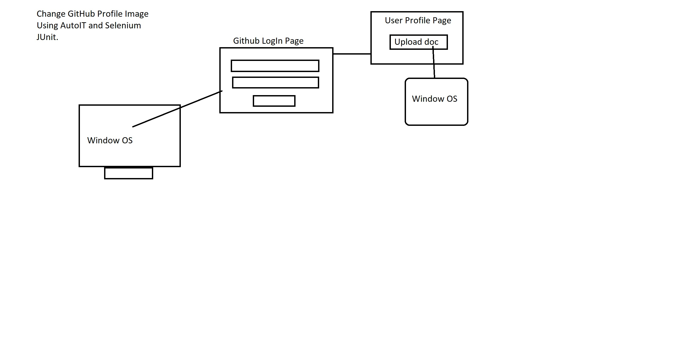

# Live Instant Class-3 Notes

## Recape: 

github link : 
1. Kitchen Story> 
    https://github.com/wahidKhan74/ecom-kitchenstory-frontend
2. https://github.com/wahidKhan74/ecom-kitchenstory

This Session ONe : Git URL:
https://github.com/wahidKhan74/phase5-selenium-junit-test-05-01-2021

This Session Two: https://github.com/wahidKhan74/phase5-selenium-testng-05-08-2021

# TestNG Annotation:

> TestNg is a complete separate framework from selenium

>It is an open source 

> 1. Reports proper
> 2. Parellel Test
> 3. Writing test sui/group
> 4. Test Parameters

# Live Instant Class-4 Notes

Git Hub Link
Session-1: : https://github.com/wahidKhan74/phase5-selenium-testng-05-08-2021

Link of AutoIT Framework: https://www.autoitscript.com/site/

[Download Link Of AutoIT Editor](https://www.autoitscript.com/site/autoit/downloads/)

Alternative of `AutoIT` is `Sikuli`. 

firfox driver: https://github.com/mozilla/geckodriver/releases

github link: https://github.com/wahidKhan74/phase5-selenium-junit-test-05-01-2021/blob/master/pom.xml 

Github Link: https://github.com/wahidKhan74/phase5-autoIT-selenium-test-05-09-2021

# Live Class-3

# Topic: Screenshots
> **TakesScreenshot** is an interface that provides *getScreenshotAs()*  method to capture the screenshot.

> It supports the following three output formats:

>  **Screenshot as file:** 
> File screenshotOnFailure = ((TakesScreenshot)driver).getScreenshotAs(OutputType.FILE);

>**Screenshot As Base64 Data**: 
>String screenshotBase64 = ((TakesScreenshot)driver).getScreenshotAs(OutputType.BASE64);

## Screenshot as raw bytes
> byte[] screenshotAsArrayOfBytesFromPNG = ((TakesScreenshot)driver).getScreenshotAs(OutputType.BYTES);


# Perform Testing On Your Application With TestNG
 *TestNG* complete separate `Frame Work` from Selenium. 

 > 
## Advantages of using *TestNG*:

- Reports Proper
- Parellel Test
- Writing test suit /group
- Test Parameter

# Configuration Annotation

> `@BeforeSuite` :  Runs before suite execution start

> `@AfterSuite` : Runs after all tests are executed

> `@BeforeTest`: Runs before first test in a <test> tag is executed

> `@AfterTest`: Runs after all the tests in a <test> tag are executed

> `@BeforeGroups`: Runs before first test method of the group(s) is executed

> `@AfterGroups` : Runs after all the test methods of the group(s) are executed

> `@BeforeClass`: Runs before first test in a class is executed

> `@AfterClass`: Runs after all the tests in a class are executed

> `@BeforeMethod`: Runs before each test in a class is executed

>`@AfterMethod`: Runs after each test is executed

```
<Suite Name>
 <test name="">
  <classes>
    <methods>

    </methods>
 </classes>
 </test>
</Suite>
```
# Set Up For TestNG

>Step-1: Create a new `maven Project` 

```
File -> New -> `Maven Project`
> Choose Archetype: `maven-archetype-quickstart `
> Group Id: com.ecom.webapp
> Artifact ID: `phase-5-selenium-testng-05-08-2021`
```
> Step-2: Add a `TestNg PlugIn`. [As `jUnit PlugIn` is already added] 
```
Go to `Help` Section and then `Eclipse Market Place` -> Search `TestNG PlugIn: TestNG for Eclipse` and click on it -> Go all default setup . accept the agreement. Then `Restart Your Eclipse Editor`
```
> Step-3: Open `pom.xml`

> Step-4: Search for `testng maven dependency` in google search.
> Download `TestNG >>7.3.0`

> Add it.

```
<!-- https://mvnrepository.com/artifact/org.testng/testng -->
<dependency>
    <groupId>org.testng</groupId>
    <artifactId>testng</artifactId>
    <version>7.3.0</version>
    <scope>test</scope>
</dependency>


```

> Remove the `jUnit ` related dependency. 

> Then add, <!--slenium java--> 

```
 <!-- selenium-java -->
   <dependency>
   <groupId>org.seleniumhq.selenium</groupId>
   <artifactId>selenium-java</artifactId>
   <version>3.141.59 </version>
   </dependency>
  </dependencies>

```

>Step - 5: Create a new `class`: `TestNgStandardAnnotationsTest`  or you can create direct `testNg class` by `Right Click on the package name -> Other -> testNg Class `

> Step-6: Update the project By : `Right Click on Project Name -> Maven -> Update Project`

>Step-7:  Start Writing Code Inside Class

> Step-8 : You do execute it as `TestNG` 


`ToDo` :: [4: 36 :00] Write A Test For TestNG based on previously  junit Test cases into TestNG test. 


# Live Class-4: 

> Write `testCase` which are dependable to eachother.   

> Creating an `testng.xml` to execute in systematic order.
>`Right click on the project name` -> `others` -> Search `xml file` -> then gaive a name as `testname.xml` And write as following code. Then Execute.

> For Execution : `Right Click on testname.xml` file -> `Run As TestNG Suite`. 

```
<?xml version="1.0" encoding="UTF-8"?>

<suite name="Amazon Test Suite" verbose="1" thread-count="1" annotations="JDK" parallel="tests">
<test name="HomepageTestUnit">
   <classes>
    <class name="com.ecom.webapp.AmazonNavigationDemo"></class>
    <class name="com.ecom.webapp.AmazonHomePage"></class>
   </classes>
</test>

<test name="GroupTestUnit">
   <classes>
    <class name="com.ecom.webapp.TestNgGroupTest"></class>
    <class name="com.ecom.webapp.TestNgStandardAnnotationsTest"></class>
   </classes>
</test>
</suite>

```

That execution create a `Report`. 
Advantages of `testng.xml` file.
> It provides a singe phase of interaction through out the projects. 

> It provide parallel execution of the tests of different classes in single time.

# Assertion APIs:

> testNg ia s `framework` inspired by `jUnit`.

> There should be `at least one` and preferbly only one , assertion for every test you write. 

> It is best to choose `assertEquals()` over `assertTrue()`  and  `assertFalse()` as it shows the exact mismatch between *expected* and *actual assertion*. 

> **TestNg Assertion** devided into two parts. 
> 1. Soft Assert :: Soft assert collects errors during @Test. Soft assert does not throw an exception when an assert fails.  

```
SoftAssert softAssert = new SoftAssert();
```
> 2. Hard Assert :: Hard assert throws an AssertException immediately when an assert statement fails and test suite continues with next @Test `assertEqual` , `assertTrue`, `assertFalse`.

# Reports Using TestNG


Inside `test-output` folder, there are  two important files:
`index.html` and `emailable-report.html` 


# AutoIT:

> AutoIT is a freeware for automating Windows GUI.

> It is typically used to automate routine tasks in `Microsoft Windows`.

> It has a built-in editor with syntax highlighting feature.

> AutoIT scripts can be made into standalone executables. 


> Selenium : -> Automate Functionality At Browser

> Window OS -> AutoIT is supportive to Window OS. 

>`AutoIT` : Open the pup-up window based on operating system  and automate it. 

> AutoIT is a framework 

[AutoIT Website](https://www.autoitscript.com/site/) 

**Download and Install**

Download the following two things: 

1. [Download Link Of AutoIT](https://www.autoitscript.com/site/autoit/downloads/)

2. [Download Link Of AutoIT Editor](https://www.autoitscript.com/site/autoit-script-editor/downloads/)

**Steps To Follow:**
1) Install AutoIT Setup
   > autoIT setup

   >auto Editor

2) Open Editor Script 
3) Open autoIT Element locator 

> To Open The **AutoIT3 Finder** :: Go to `C Drive` -> `Program Files` -> `AutoIT3 `-> Click On `Au3Info_x64` Then you get `AutoIt Finder`. 

> To Open The **AutoIT3 Editor** :: Go To `C:\Program Files (x86)\AutoIt3\SciTE` -> Then Click on `SciTE.exe` . It will open the `Editor Window Value`. 

To write *`testScript`*, we create a new folder first.
> Write `testScript`:

**AutoIT Help:** Showcase the complete details of the command. 

> We use `AutoIT` as a tool to automate the task. 


# Example-1: Upload profile image using AutoIT and Selenium jUnit. 



Steps To follow:  
 *To update github profile pic.*
> Go to your `Github Account`. Click on `Profile Pic`->Edit-Upload
> Then, go to the path of the `pic`. 

> Then with the help of `AutoIt Finder` and `AtuoIt Editor` Write script command as follows: . 


```
ControlFocus("Open","","Edit1");

ControlSetText("Open","","Edit1","E:\profile.png");

ControlClick("Open","","Button1");

```
> After writing this code, save the file in an appropriate location. 

> It will create a file with extension of `fileName.au3` file.
> Next :: Convert that file by right click on it -> `Compile_X64 `bit ->It will genearate `filename.exe` file. And, now use this file to automate the functionality.

Execution of above example:
> Go to your `Github Account`. Click on `Profile Pic`->Edit-Upload
> Then Click on the `AutoIt.exe File`. 

> And set new profile pic. 

> We use `AutoIT` as a tool to automate the task, which we can't able to do by using selenium.

Next Let's write selenium code to work on other functionality.

Using `jUnit` : 

> Create new `maven Project` as `quick start` archetype . 

> Then Add `driver folder`, where you can keep the driver of your `choice`. Then `Right Click` -> `Refresh`. 

> Add `jUnit depenedency` in `pom.xml`. 

> Then RightClick On The Project Name -> Maven -> Update Project -> Ok. 

> Start writing Code -> Compile it 

> ToDo :: Try it using `testNg` too
