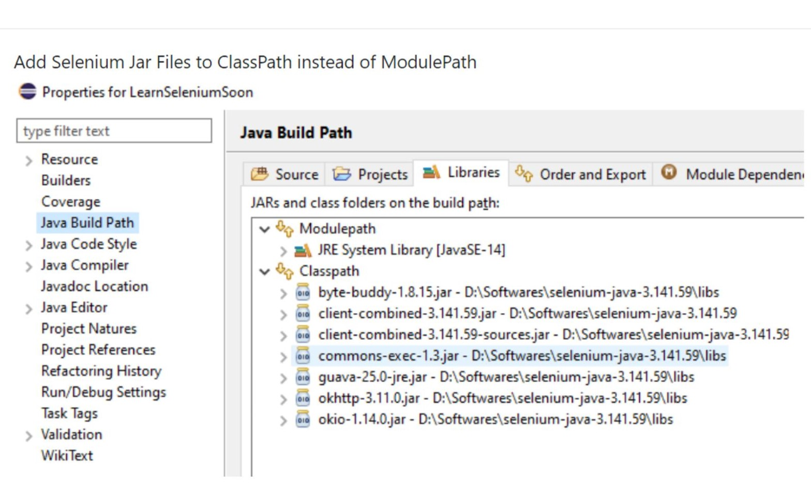

# Topic: Selenium EdgeDriver 
# Steps To Set Up A WebDriver in MirosoftEdge Browser: 

## I choose : For language-> Java || Browser-> Microsoft Edge:Edge Driver ||And Tools-> Eclipse

1. > Download Selenium Standalone Server.jar from the official site:  [Click Here To Download .jar File For Java](https://www.selenium.dev/downloads/)

2. > Download Selenium WebDriver `Specific to your Browser`. I choose [Microsoft Edge Browser i.e. Edge Browser Version: 90.0.818.56: x64 ](https://developer.microsoft.com/en-us/microsoft-edge/tools/webdriver/#downloads)

3. > Lunch Eclipse and create a java project or maven based java project
   
4. > Configure `WebDriver` with Eclipse.

>Now , you all set to write your first test script using `Selenium Web Driver With Eclipse`.  

>`Note:` Keep all the `selenium standalone .jar files` and `selenium web browser` in `one folder` to configure easily .    


##  Run Selenium Tests On Edge 

Reference: [Article](https://www.toolsqa.com/selenium-webdriver/run-selenium-tests-on-edge/)

> Step-1: Check the current version of `Microsoft Edge`

```
> click on three dots of right upper corner -> setting -> About Microsoft Edge
My `Microsoft Edge Version ` is : `Version 90.0.818.56` (official build) (64-bit)
```
> Step-2: Now as we have the version of the Microsoft Edge Browser, We can go ahead and download the EdgeDriver from the Official site of Microsoft Edge WebDriver Site. [Microsoft Edge WebDriver](https://developer.microsoft.com/en-us/microsoft-edge/tools/webdriver/#downloads) 
Select the compatible version . 
For Me Compatible Version Is:` Version:90.0.818.56:x64`[Download It]

> Step-3:  After that , once the download is complete , extract the *.zipfile* and place the content at any preffered loacation. 

>Step-4: Now open `eclipse` and create a java project . Add all the dependencies to the project. 

- Additionally, learn how to set up a java project along with Selenium WebDriver in Eclipse.
  
-  Visit the [Tutorial On Configuration Selenium WebDriver](https://www.toolsqa.com/selenium-webdriver/configure-selenium-webdriver-with-eclipse/)


> Refer The [Article: Selenium WebDriver](https://www.toolsqa.com/selenium-webdriver/download-selenium-webdriver/)

## How to download the Selenium WebDriver for JAVA only. 
> Step-5: Download Selenium WebDriver For JAVA from the official [Selenium Website](https://www.selenium.dev/downloads/)

>Step-6: After That Click On The Download Link for the `Java Driver`. The Latest Stable version Of Selenium WebDriver. 

> Step-7: Once th e zip file downloaded, Extract the file so , you can see the unzipped `Selenium Java Folder`. 

> Step-8: Once The Extraction Is Complete, Open the downloaded Selenium Folder. 

The Extracted folder content followings:

- libs folder– It contains the jar files that support Selenium execution and provide
- Two jar files that are essentially the selenium jars to use Selenium WebDriver
- The CHANGELOG file includes the details of the version changes along with the features offered by each of them.
- The LICENSE and NOTICE files contain the license details and the notice corresponding to the Selenium bindings.


All these jars and the supporting files in the` libs folder` will be needed while we will be developing the automated test cases and will provide details about the same while [configuring Selenium WebDriver in Eclipse.](https://www.toolsqa.com/selenium-webdriver/configure-selenium-webdriver-with-eclipse/)

Note: After extration of the selenium Standalone Server.jar file , the .jar files which are outside the `libs` folder, do keep inside the `lib folders` . 

# How to setup EdgeDriver on Windows globally, using environment variables?


# Configure Selenium WebDriver With Eclipse:

> Step-9: Launch Eclipse And Create A WorkSpace ?

> My Current Workspace Name: ` FSD-5 Workspace-Practice-Projects `

>**Step-1:** Create New Java Project In Eclipse:

 ```
File-> New -> Other -> java project 

Project Name: phase5-selenium-test-05-01-2021
 ```
 **Note:**  Click `No to open perspective pup up window`. 

> **Step-2**: Copy all the libreries files , what you have downloaded to the current project.Then rightclick on the project name and  `refresh` the project .

>**Step-3:** ` How to add Selenium WebDriver Jars to the project?`
```
After it, Right click on the `project name` -> Click on `Build Path` -> `Configure Build Path` -> Click on `Libraries` -> `Add Jars` -> Then Add all the `.jar files inside lib folder in ClassPath` -> `click ok` -> `Click on Apply and Close` .
```

>**Step-4:** Now Let's write `test cases`. So create ` A Class`. 
```
So Package Name:com.ecom.webapp.test 
File Name : GoogleHomePageTest
And Check the Main Method.
```

>**Step-5:** Write The code for the `Class: FirstTestCase` .

```
//FirstTest: Is For Google Home Page Test. 
//1. Formulate A Base Test URL

//2. Locate A Web Driver BY Locating the path

//3. Set Selenium System Properties.

//4. Instsntiate Selenium Web Driver . That means Create an object of the web driver.

//5. Launch Browser

//6. Perform Test Evaluation 

//7. Close Driver 
 driver.quit();


```

# Solution of Not Detecting Webdriver : 
> Add selenium Jar Files To ClassPath insted of ModulePath .
